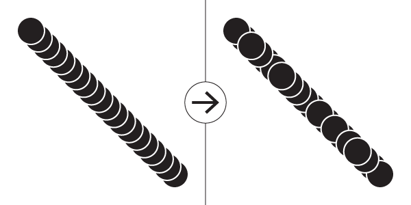
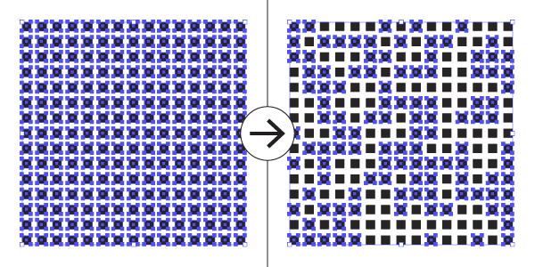

# Overview

A collection of scripts for Adobe Illustrator. Free to use, modify, and redistribute. Hopefully more and more scripts will be added with time.

|Script|Description
|:---|:---|
|[RandomLayerOrder.jsx](#randomlayerorderjsx)|Randomize the layer order of all selected objects|
|[RandomSelection.jsx](#randomselectionjsx)|Randomly select a percentage or specific number of objects from within the current selection. |

# Scripts

## RandomLayerOrder.jsx

This script can be used to randomize the layer order of all selected objects, with or without respect to parent layers.

### Notable features:

* Randomize layer order without relying on `ZOrderMethod` commands that other layer order randomizer scripts use. Instead, this script works by swapping two layer positions in a randomized manner.
* Optionally respect parent layers. With this option enabled, layers will stay within their own parent layers and will only be randomized relative to other selected layers in their same parent layer.

### How to use:

1. Select all objects whose layer order you want to randomize.
2. Open the script. This can be done in Illustrator's menu (File > Scripts > Other Script).
3. Check whether or not you want parent layers to be respected.
4. Click 'OK'

 

## RandomSelection.jsx

This script can be used to randomly select a percentage or specific number of objects from within the current selection. There have been many random selection scripts for Adobe Illustrator before, but this one has a couple of features that some others are missing.

### Notable features:

* Select by percentage or by exact number of objects.
* The selection algorithm is optimized so that it will select or deselect based on how many operations have to be completed. For example, if you're selecting 4 random objects from a set of 1000, it will deselect everything, and then randomly select 4 objects. Conversely, if you're selecting 996 objects out of 1000, it will not deselect everything first. It will just deselect 4 random objects.

### How to use:

1. Select which objects you want to randomize the selection of.
2. Open the script. This can be done in Illustrator's menu (File > Scripts > Other Script).
3. Select which selection mode you'd like to use. 
	* The *'Percentage'* mode will randomly select a specified percentage of objects from the currently selected set of objects.
	* The *'Count'* mode will randomly select an specified number of objects from the currently selected set of objects.
4. Enter the value in the *'Value'* field.
	* For the percentage mode, this value should be between 0 and 100.
	* For the count mode, this value should be between 1 and however many items are in the current selection.
5. Click 'OK'
	* This will execute the script and randomly select a number of objects based on entered parameters.

### Notes:

* It may take some time to run the script on large sets of objects. This is because of the fact that the core of this script works by flipping the `.selected` flag of objects within Illustrator via ExtendScript. This necessarily means that Illustrator redraws the whole screen every time a single object has its `.selected` flag modified. It's an unfortunate limitation of how Adobe has implemented this particular feature within ExtendScript.
* This script is a stripped-down version of [Randomill's](https://randomill.com/) random select function. The main difference between the two is that the full version of this function within [Randomill](https://randomill.com/) has an 'experimental' fast-select mode that circumvents the above speed limitation by creating an executing an action dynamically instead of iterating over objects and flipping their `.selected` flags. This means that random selection can happen almost instantaneously, regardless of how large the initial set of objects is.
