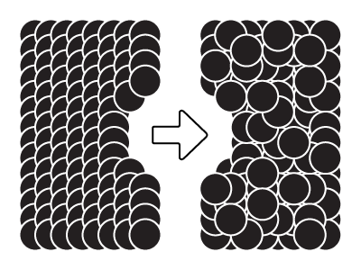
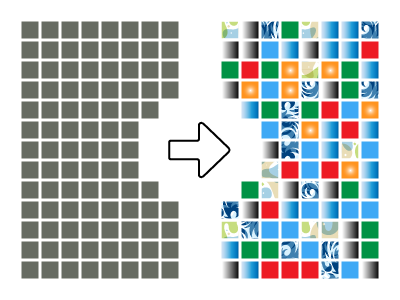
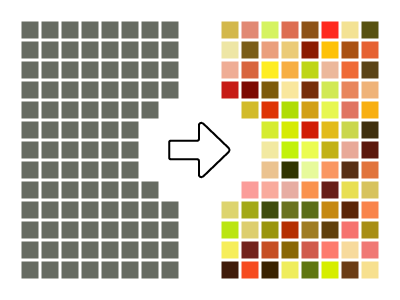
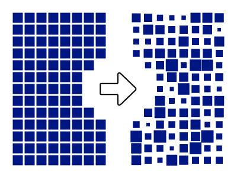
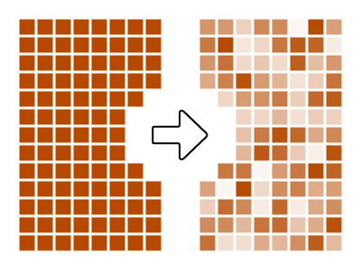

| Script                                                   | Description                                                                                     |
| :------------------------------------------------------- | :---------------------------------------------------------------------------------------------- |
| [RandomLayerOrder.js](#randomlayerorderjs)               | Randomize the layer order of all selected objects                                               |
| [RandomSelection.js](#randomselectionjs)                 | Randomly select a percentage or specific number of objects from within the current selection.   |
| [RandomColorFromSwatches.js](#randomcolorfromswatchesjs) | Randomly apply fill or colors to selected objects from swatches selected in the swatches panel. |
| [RandomColorFromRange.js](#randomcolorfromrangejs)       | Randomly apply fill or stroke colors to selected objects from configurable HSL/RGB/CMYK ranges. |
| [RandomScale.js](#randomscalejs)                         | Randomly scale objects uniformly, or independently along X,Y axes.                              |
| [RandomOpacity.js](#randomscalejs)                       | Randomize opacity from a min/max range and a configurable step size.                            |

## How to run scripts in Illustrator

1. **Prep selection/document.** Depending on the script, you may want to select items the script should affect, or otherwise get the document ready for the script to run.
2. **Open the script.** This can be done in Illustrator's menu **(File > Scripts > Other Script)**.
3. **Configure options.** If the script has a UI, you can dial in some options.
4. **Execute thes script.** If there's no UI, this will happen automatically, otherwise there will be something like an 'OK' or 'Apply' button.

## RandomLayerOrder.js

This script can be used to randomize the layer order of all selected objects, with or without respect to parent layers. A unique aspect of this script is that it works without relying on `ZOrderMethod` commands that other layer order randomizer scripts use. Instead, this script works by swapping two layer positions in a randomized manner.

This script also supports respecting parent layers and overall layer hierarchy. With this option enabled, layers will stay within their own parent layers and will only be randomized relative to other selected layers in their same parent layer.

**Need more features? Check out [Randomill](https://randomill.com/).** Randomill allows for reversing and arranging layer order by object position on the artboard. Objects can be sorted in the layer stack by their X,Y coordinates on the artboard, and can even optionally account for stroke widths in object bound calculation for more accurate ordering.

 

## RandomSelection.js

This script can be used to randomly select a percentage or specific number of objects from within the current selection. There have been many random selection scripts for Adobe Illustrator before, but this one has a couple of features that some others are missing.

The selection algorithm is optimized so that it will select or deselect based on how many operations have to be completed. For example, if you're selecting 4 random objects from a set of 1000, it will deselect everything, and then randomly select 4 objects. Conversely, if you're selecting 996 objects out of 1000, it will not deselect everything first. It will just deselect 4 random objects.

**Need more features? Check out [Randomill](https://randomill.com/).** Randomill's random select function is about 100x faster than this script. It has an optimized fast-select mode that circumvents ExtendScript's speed limitation by creating an executing an action dynamically instead of iterating over objects and flipping their `.selected` flags like this script does. This means that random selection can happen almost instantaneously, regardless of how large the initial set of objects is. There are also several other selection features included in Randomill like selecting by position in layer stack, selecting every Nth object, etc.

## RandomColorFromSwatches.js

Randomize fill and/or stroke colors from selected swatches in the swatches panel. Since the script relies on selected swatches, you can apply gradients, patterns, spot colors, and any other type of swatch to selected objects. Compatible objects are: PathItems, CompoundPathItems, GroupItems, and TextFrames.

**Need more features? Check out [Randomill](https://randomill.com/).** Swatches can be imported into Randomill's UI, and applied randomly to the selection without having to re-run the script or re-select swatches. Swatches can also be applied in a specific sequence to the select, and easily added/removed from the set. Randomill can also progressively shift color values, apply blends, offset colors, loop through colors, and more.

## RandomColorFromRange.js

Randomize fill and/or stroke colors from configurable ranges. Colors can be applied as RGB, CMYK, or HSL colors. Minimum and maximum values can be set to constrain ranges of each individual variable. Compatible objects are: PathItems, CompoundPathItems, GroupItems, and TextFrames.

**Need more features? Check out [Randomill](https://randomill.com/).** Randomill's color range functions feature interactive sliders to configure ranges, and can invert the HUE min/max ranges to allow for greater flexibiity. Strokes and fills can be applied independently and repeatedly without having to re-dial ranges, or re-select swatches.

## RandomScale.js

Randomize scale from a min/max range and a configurable step size. Objects can be scaled uniformly or independently,

**Need more features? Check out [Randomill](https://randomill.com/).** Randomill's random scale function features options to randomize the anchor point around which objects are scaled, allows users to independently scale fill/stroke patterns or widths, and scale text per character, per word, etc. There are also 3 additional scale modification functions apart from randomization.

## RandomOpacity.js

Randomize opacity from a min/max range and a configurable step size.

**Need more features? Check out [Randomill](https://randomill.com/).** Randomill's random opacity function goes beyond just randomization, allowing users to offset opacity while iterating through objects, approach a target opacity incrementally, or oscillate opacity between two values.
