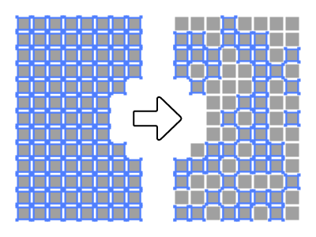

A collection of free illustrator scripts focused on randomization.

## Script summary

| Script                                                   | Description                                                                                     |
| :------------------------------------------------------- | :---------------------------------------------------------------------------------------------- |
| [RandomLayerOrder.js](#randomlayerorderjs)               | Randomize the layer order of all selected objects                                               |
| [RandomSelection.js](#randomselectionjs)                 | Randomly select a percentage or specific number of objects from within the current selection.   |
| [RandomColorFromSwatches.js](#randomcolorfromswatchesjs) | Randomly apply fill or colors to selected objects from swatches selected in the swatches panel. |
| [RandomColorFromRange.js](#randomcolorfromrangejs)       | Randomly apply fill or stroke colors to selected objects from configurable HSL/RGB/CMYK ranges. |
| [RandomScale.js](#randomscalejs)                         | Randomly scale objects uniformly, or independently along X,Y axes.                              |
| [RandomOpacity.js](#randomopacityjs)                     | Randomize opacity from a min/max range and a configurable step size.                            |
| [RandomPosition.js](#randompositionjs)                   | Offset position by a random value from a min/max range and a configurable step size.            |
| [RandomRotation.js](#randomrotationjs)                   | Randomly rotate objects be a random value from a min/max range and a configurable step size.    |

## Need more features? Check out [Randomill](https://randomill.com/)

Randomill encapsulates all of the below scripts into a beautiful UI that looks like a native illustrator panel. All of the improved functions can be run simultaneously, or individually without having to close the panel or run additional scripts.

Per-function table of what Randomill offers over these individual scripts:

| Script                     | Randomill Upgrade                                                                                                                                   |
| :------------------------- | :-------------------------------------------------------------------------------------------------------------------------------------------------- |
| RandomLayerOrder.js        | In addition to randomizing, Randomill can reverse layer order, and sort layer order of objects by their positions on the artboard.                  |
| RandomSelection.js         | Uses much faster select method, allowing for thousands of objects. Also features "Every Nth" selection mode, and "Stack" selection mode.            |
| RandomColorFromSwatches.js | Add, remove, and re-arrange swatches in the panel UI, 3 additional color algorithms: "offset/shift", "loop", and "blend".                           |
| RandomColorFromRange.js    | Randomill features interactive color sliders with preview, 3 more color algorithms, and way more options.                                           |
| RandomScale.js             | Randomill allows for scaling of object properties independently, adjusting scale anchor, text scaling options, and 3 additional scaling algorithms. |
| RandomOpacity.js           | Three additional opacity algorithms other than randomization (offset/shift, target, oscillate).                                                     |
| RandomPosition.js          | Reposition object properties independently, 3 additional position algorithms.                                                                       |
| RandomRotation.js          | Rotate object properties independently, choose transformation anchor, 3 additional rotation algorithms.                                             |

## How to run scripts in Illustrator

1. **Prep selection/document.** Depending on the script, you may want to select items the script should affect, or otherwise get the document ready for the script to run.
2. **Open the script.** This can be done in Illustrator's menu **(File > Scripts > Other Script)**.
3. **Configure options.** If the script has a UI, you can dial in some options.
4. **Execute thes script.** If there's no UI, this will happen automatically, otherwise there will be something like an 'OK' or 'Apply' button.

## RandomLayerOrder.js

This script can be used to randomize the layer order of all selected objects, with or without respect to parent layers. A unique aspect of this script is that it works without relying on `ZOrderMethod` commands that other layer order randomizer scripts use. Instead, this script works by swapping two layer positions in a randomized manner.

This script also supports respecting parent layers and overall layer hierarchy. With this option enabled, layers will stay within their own parent layers and will only be randomized relative to other selected layers in their same parent layer.

 

## RandomSelection.js

This script can be used to randomly select a percentage or specific number of objects from within the current selection. There have been many random selection scripts for Adobe Illustrator before, but this one has a couple of features that some others are missing.

The selection algorithm is optimized so that it will select or deselect based on how many operations have to be completed. For example, if you're selecting 4 random objects from a set of 1000, it will deselect everything, and then randomly select 4 objects. Conversely, if you're selecting 996 objects out of 1000, it will not deselect everything first. It will just deselect 4 random objects.

## RandomColorFromSwatches.js

Randomize fill and/or stroke colors from selected swatches in the swatches panel. Since the script relies on selected swatches, you can apply gradients, patterns, spot colors, and any other type of swatch to selected objects. Compatible objects are: PathItems, CompoundPathItems, GroupItems, and TextFrames.

## RandomColorFromRange.js

Randomize fill and/or stroke colors from configurable ranges. Colors can be applied as RGB, CMYK, or HSL colors. Minimum and maximum values can be set to constrain ranges of each individual variable. Compatible objects are: PathItems, CompoundPathItems, GroupItems, and TextFrames.

## RandomScale.js

Randomize scale from a min/max range and a configurable step size. Objects can be scaled uniformly or independently,

## RandomOpacity.js

Randomize opacity from a min/max range and a configurable step size.

## RandomPosition.js

Offset position by a random value from a min/max range and a configurable step size. Randomize X and Y position offsets independently.

## RandomRotation.js

Randomly rotate objects be a random value from a min/max range and a configurable step size. Objects inside groups can be configured to be randomly rotated as a group, or to have each object in the group rotated separately. The same option is available for compound paths.
